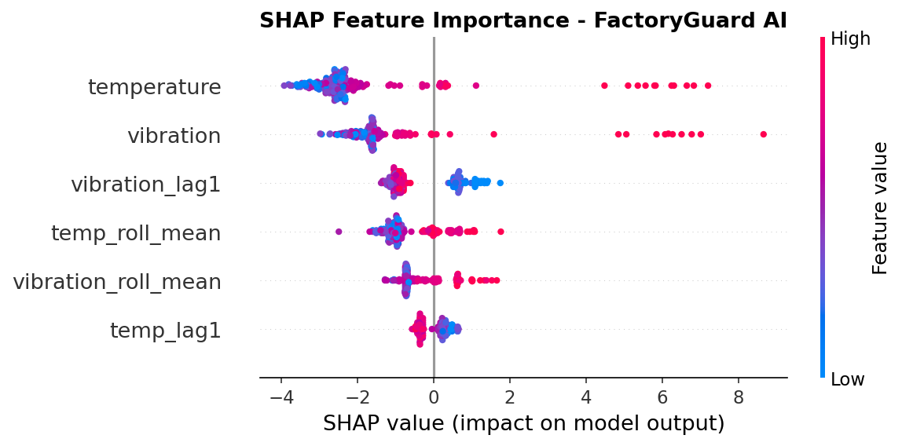
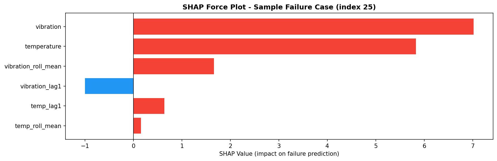

# 🚀 FactoryGuard AI

> **AI-Powered Predictive Maintenance System**
> Developed during Internship at Infotact Solutions | Cohort Zeta | Q4 2026

---

## 📌 Overview

FactoryGuard AI is a production-ready machine learning system designed to predict industrial machine failures using IoT sensor data.
It helps reduce downtime, optimize maintenance, and improve operational efficiency.

---

## 🎯 Problem Statement

A large-scale manufacturing facility operates **500+ robotic machines**.
Unexpected failures result in **$10,000/hour downtime losses**.

👉 This system predicts failures **in advance**, enabling proactive maintenance.

---

## ⚙️ Features

* 🔍 Predict machine failure (binary classification)
* ⚖️ Handle imbalanced data
* 🧠 Advanced ML models (Logistic Regression, Random Forest, XGBoost)
* 📊 Model explainability using SHAP
* ⚡ Real-time prediction via Flask API
* 🏗️ Feature engineering (rolling mean + lag features)

---

## 🧠 Tech Stack

* Python
* Pandas, NumPy
* Scikit-learn
* XGBoost
* SHAP
* Flask

---

## 🏗️ Project Architecture

```
Sensor Data → Preprocessing → Feature Engineering → ML Models → Prediction → SHAP Explainability
```

---

## 📊 Model Performance

| Model               | F1 Score                 |
| ------------------- | ------------------------ |
| Logistic Regression | 0.82                     |
| Random Forest       | 0.92                     |
| XGBoost             | **0.95 🔥 (Best Model)** |

---

## 📸 Results & Explainability

### 🔹 SHAP Feature Importance



### 🔹 SHAP Force Plot (Individual Prediction)



---

## 📂 Project Structure

```
FactoryGuard_AI/
│
├── data/
├── models/
│   └── model.pkl
│
├── src/
│   ├── data_preprocessing.py
│   ├── feature_engineering.py
│   ├── evaluate.py
│
├── assets/
│   ├── shap_summary_plot.png
│   ├── shap_force_plot.png
│
├── app.py
├── run_training.py
├── requirements.txt
└── README.md
```

---

## ▶️ How to Run

### 1️⃣ Install Dependencies

```bash
pip install -r requirements.txt
```

### 2️⃣ Train Model

```bash
python run_training.py
```

### 3️⃣ Run API

```bash
python app.py
```

---

## 🌐 API Example

### Request

```json
{
  "temperature": 85,
  "vibration": 0.8,
  "temp_roll_mean": 82,
  "vibration_roll_mean": 0.75,
  "temp_lag1": 84,
  "vibration_lag1": 0.7
}
```

### Response

```json
{
  "failure_prediction": 1,
  "failure_probability": 0.95
}
```

---

## 📊 Explainability (SHAP)

SHAP (Shapley Additive Explanations) is used to interpret model predictions.
It helps identify which features contribute most to machine failure.

---

## 💼 Internship Experience

This project was developed during my internship at **Infotact Solutions**,
where I worked on real-world industrial AI applications.

---

## 👨‍💻 Author

**Nisha Malani**

---

## ⭐ Project Highlights

* End-to-end ML pipeline
* Real-world industrial use case
* Explainable AI (XAI) integration
* Production-ready structure

---
